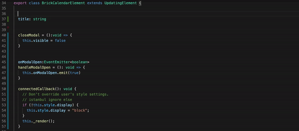

# VS Code Brick Next Sippets

This extension provide Brick Next and React snippets in Typescript with babel plugins features for Vs Code

## Tutorial



## Snippets

### property - Insert a property annotaions

```typescript 
  /**
   * @default 
   * @required 
   * @description 
   */
  @property()
```

### method - Insert a method annotaions

```typescript 
  /**
   * @description 
   */
  @method()
```

### event - Insert a event annotaions

```typescript 
  /**
   * @detail 
   * @description 
   */
  @event({type: ""}) 
```

### story - Create a story

```typescript 
import { Story } from "@easyops/brick-types";

export const AlexStory: Story = {
  storyId: "",
  category: "",
  type: "brick",
  author: "",
  text: {
    en: "",
    zh: ""
  },
  tags: [],
  description: {
    en: "",
    zh: ""
  },
  icon: {
    lib: "antd",
    icon: ""
  },
  conf: []
}
```

### routeconf - Create a route conf

```typescript 
import { RouteConf } from "@easyops/brick-types";

export const AlexRoute: RouteConf = {
    path: "",
    type: "routes",
    routes: []
}
```
